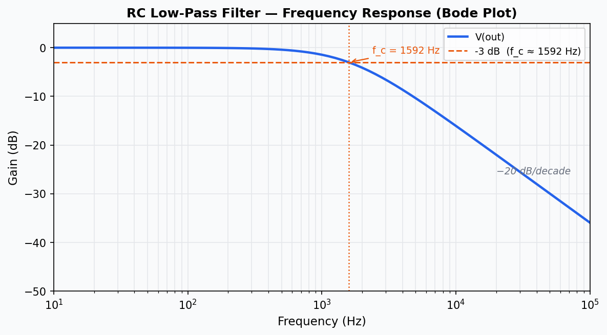
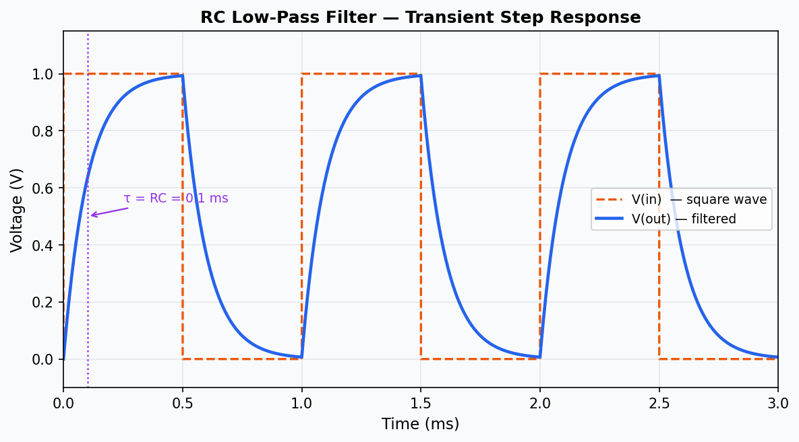

# mcp-ngspice

An MCP (Model Context Protocol) server that wraps [ngspice](https://ngspice.sourceforge.io/), the open-source SPICE circuit simulator. Lets Claude design, simulate, and analyze electrical circuits through natural language.

## Features

- Generate SPICE netlists from structured component descriptions
- Run ngspice simulations and capture results
- Parse `.raw` output files (ASCII and binary formats)
- Sweep any circuit parameter across a range with parallel execution
- List and filter past simulation runs
- Reference data for all standard SPICE components
- **21 built-in circuit templates** — filters, amplifiers, MOSFET, op-amp stages, SMPS converters
- **External model library support** — save `.lib` files and reference them in any netlist

## Requirements

- [Node.js](https://nodejs.org/) 18+
- [ngspice](https://ngspice.sourceforge.io/download.html) installed and on PATH (Windows: extracted to `C:\Spice64\`)
- [Claude Desktop](https://claude.ai/download)

## Installation

```bash
git clone https://github.com/pavlol/mcp-ngspice.git
cd mcp-ngspice
npm install
npm run build
```

## Claude Desktop Configuration

Config for Windows:
Add the server to `%APPDATA%\Claude\claude_desktop_config.json`:
If does not work, add it here:
AppData\Local\Packages\Claude_pzs8sxrjxfjjc\LocalCache\Roaming\Claude\
OR search and use :
%LOCALAPPDATA%\Packages\Claude_pzs8sxrjxfjjc\LocalCache\Roaming\Claude\

Modern Windows apps distributed via the Store (even when downloaded from a vendor's own website) are sometimes packaged as MSIX/UWP containers. This packaging system creates two separate AppData paths
So the app writes to and reads from the Packages\Claude_pzs8sxrjxfjjc\LocalCache\Roaming\Claude\ path — the other one at AppData\Roaming\Claude\ exists but is never read by the running app.
The UWP container intercepts filesystem calls. When Claude Desktop tries to access AppData\Roaming\Claude\, Windows silently redirects it to the LocalCache\Roaming\Claude\ path inside the package container. The file at AppData\Roaming\Claude\ is a ghost — it exists but the app never sees it.


```json
{
  "mcpServers": {
    "ngspice": {
      "command": "node",
      "args": ["C:\\path\\to\\mcp-ngspice\\dist\\index.js"],
      "cwd": "C:\\path\\to\\mcp-ngspice"
    }
  }
}
```

Restart Claude Desktop after saving the config.

## Tools

| Tool | Description |
|------|-------------|
| `create_netlist` | Generate a `.cir` netlist from a component list and analysis commands |
| `run_simulation` | Run a netlist through ngspice, return simulation ID and log summary |
| `parse_results` | Parse the `.raw` output file for a given simulation ID |
| `sweep_parameters` | Run multiple simulations varying one parameter over a range |
| `list_simulations` | List past simulation runs with filtering and sorting |
| `get_component_info` | SPICE syntax reference for R, C, L, V, I, D, Q, M, X |
| `list_templates` | List all 21 built-in circuit templates with metadata |
| `get_template` | Retrieve a ready-to-run netlist for a named template |
| `save_lib_file` | Save a SPICE model `.lib` file to the local models directory |
| `list_lib_files` | List saved model library files |
| `delete_lib_file` | Delete a model library file |

See [USER_GUIDE.md](USER_GUIDE.md) for detailed usage examples.

## Example: RC Low-Pass Filter Simulation

Ask Claude: **"Simulate the RC low-pass filter"**

Claude calls `get_template("rc-lowpass")` to retrieve the netlist (R1 = 1 kΩ, C1 = 100 nF, f_c ≈ 1592 Hz), then runs `run_simulation` and `parse_results` to extract the waveform data.

### Frequency Response (Bode Plot)

The AC analysis sweeps 10 Hz – 100 kHz. The output rolls off at −20 dB/decade above the cutoff frequency, exactly as predicted by theory.



### Transient Step Response

The transient analysis drives the filter with a 1 kHz square wave. V(out) charges and discharges with the RC time constant τ = R·C = 100 µs, smoothing the sharp edges of the input.



| Parameter | Value |
|-----------|-------|
| R1 | 1 kΩ |
| C1 | 100 nF |
| Cutoff frequency f_c | 1592 Hz |
| Time constant τ | 100 µs |
| Roll-off | −20 dB/decade |
| Simulation points (AC) | 81 |
| Simulation points (Transient) | 725 |

## Development

```bash
npm run dev      # run with tsx (no build step)
npm run build    # compile TypeScript → dist/
```

Simulation netlists are saved to `circuits/`, outputs to `results/`.

## License

MIT
